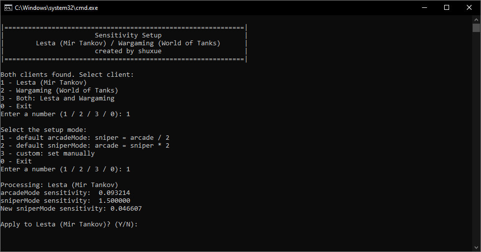

# Sensitivity setup for aim-mode

	&bull; <a href="#en">EN</a> &bull; <a href="#ru">RU</a> 

## EN

### Description

Automates interaction with the game's configuration file:
- Open the file in Explorer and Notepad
- Create a backup copy of the file
- Restore a file from a backup copy
- Show current sensitivity values
- Set sensitivity values

### How to use

- Download the release
- Unzip
- Select language
- Go to .bat files
- Next:

To look at the current sensitivity values, run the **"show current sensitivity in --preferences.bat"**

To open the **"preferences.xml"** file in Explorer and Notepad, run **"open --preferences.bat"**

To back up the **“preferences.xml”** file, run **"1 - backup --preferences.bat"**

To restore the **“preferences.xml”** file from a backup, run **"0 - restore from backup --preferences.bat"**

To set a new sensitivity in the **“preferences.xml”** file, run **"2 - start sensitivity setup.bat"**

### Theory

The method that multiplies or divides by 2 is MDV 100%.  
If you are satisfied with sensitivity in 1 of 2 modes: arcadeMode or sniperMode, the script will make calculations and record the new sensitivity.  
Manual input will allow you to set any sensitivity for both modes.  
This script was created for those cases when a person cannot figure out the manual sensitivity setting on independently.

## RU

### Описание

Автоматизирует взаимодействие с конфигурационным файлом игры:
- Открыть файл в проводнике и блокноте
- Создать резервную копию файла
- Восстановить файл из резервной копии
- Показать текущие значения чувствительности
- Задать значения чувствительности

### Как использовать

- Скачать релиз
- Разархивировать
- Выбрать язык
- Перейти к .bat файлам
- Далее:

Чтобы посмотреть на текущие значения чувствительности, запустите **"показать текущую чувствительность в --preferences.bat"**

Чтобы открыть файл **"preferences.xml"** в проводнике и блокноте, запустите **"открыть --preferences.bat"**

Чтобы сделать резервную копию файла **"preferences.xml"**, запустите **"1 - создать бэкап --preferences.bat"**

Чтобы восстановить файл **"preferences.xml"** из резервной копии, запустите **"0 - восстановить из бэкапа --preferences.bat"**

Чтобы задать новую чувствительность в файл **"preferences.xml"**, запустите **"2 - начать настройку чувствительности.bat"**

### Теория

Метод который умножает или делит на 2 - это MDV 100%.  
Если вас устраивает чувствительность в 1 из 2 режимов: arcadeMode или sniperMode, то скрипт сделает вычисления и запишет новую чувствительность.  
Ручной ввод позволит установить любую чувствительность для обоих режимов.  
Этот скрипт создан для тех случаев, когда человек не может самостоятельно разобраться в ручной настройке чувствительности.
